# Memes-Classification-Model-End-to-End-Solution

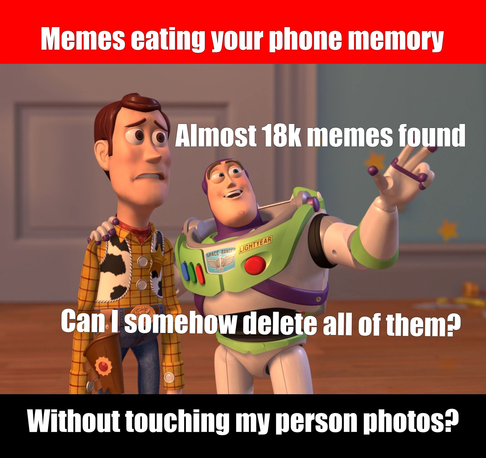

## Introduction

WhatsApp has over 1.2 billion daily active users today. WhatsApp has become an indispensible part of our lives. The app has made it fast and easier to stay connected with our friends.
However, it can be little annoying at times when the chat app automatically download all those stupid memes, audio files, videos and photos. This not just makes the phone's gallery look like a complete mess, it also eats up you mobile data. Here is a fix to this to this problem.
Too many WhatsApp images, videos making your phone slow down. Deleting whole WhasApp Images folder is bad option because it may contain our important personal images.
So we need to somehow seperate out unnecessary memes picture and our personal images.

**Can we build a model which can identify memes images and real images**?

Google's File app is there to help you out it is finding memes images and listed those images to user, then user will decide whichone he/she want to keep in phone and whichone he/she would like to delete.
Memes detection app is similar small demo version app.

## Problem Statement :
Classify Memes images from phone gallery without touching personal images. Find out memes images from gallery.

## Real world/Business Objectives and Constraints :
- The cost of a mis-classification can be very high. Because suppose if image is not meme and we classified it is as meme then it not good for app.
- Latency concerns. Model should quickly identify image meme or not. Otherwise app thrown into trash.

## Performance Metric:
- Binary cross entropy

## Deploy Model

1. Deploy model on andriod environment
2. Deploy moodel on server using flask

### 1. Deploy model on andriod environment
We fine-tune couple of models. **MOBILE-NET** model on fine tuned and convert to .tflite using **TFLite** library. Full code can be found
- https://github.com/pranaysawant/Memes-Classification-Model-End-to-End-Solution/tree/master/AndroidApp

### 2. Deploy model on server using flask
We fine-tune **VGG19** model and deployed on GCP server using **Flask** framework. We have written REST API for the same. code can be found 
- https://github.com/pranaysawant/Memes-Classification-Model-End-to-End-Solution/tree/master/FlaskApp

## Blog :
- [Medium blog can be found here](https://medium.com/@pranaysawant22/memes-detection-android-app-using-deep-learning-d2c65347e6f3?sk=e2cf91901751bdf74512250483f3602e)
- [Medium blog for deploying on android platform can be found here](https://medium.com/@pranaysawant22/deploy-mobilenet-model-to-android-platform-2886789a7628?sk=94b9093d249ce57c134c46600c9b90b1)
- [Medium blog for deploying on flask GCP can be found here](https://medium.com/@pranaysawant22/deploy-keras-model-to-flask-app-rest-apis-f9f4e834e3bd?sk=d8f7c429f0c1410e9f0be236a7e5b487)

## Result:

### Below is "Files" app provided by Google.

| | | |
|:-------------------------:|:-------------------------:|:-------------------------:|
|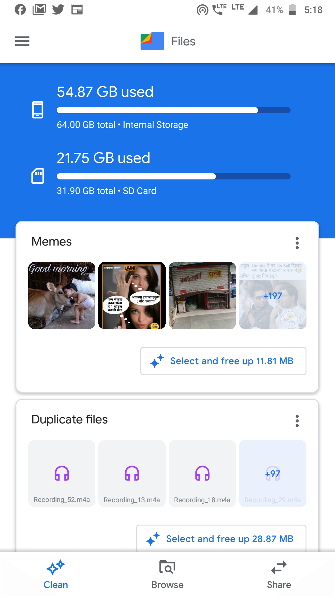    | 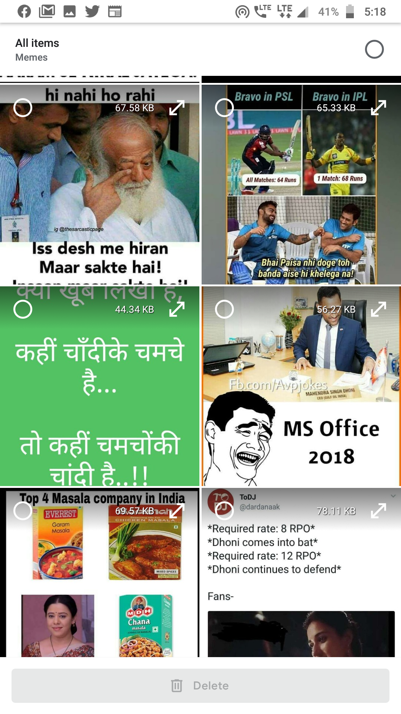 |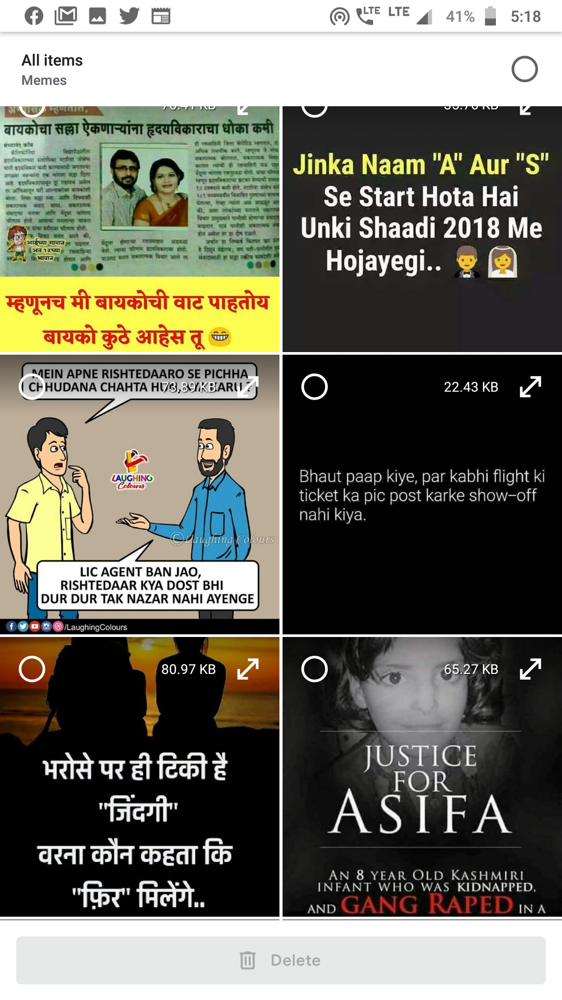 |

### Below is Memes Classification App

##### 1. Landing Page

| | |
|:-------------------------:|:-------------------------:|
| 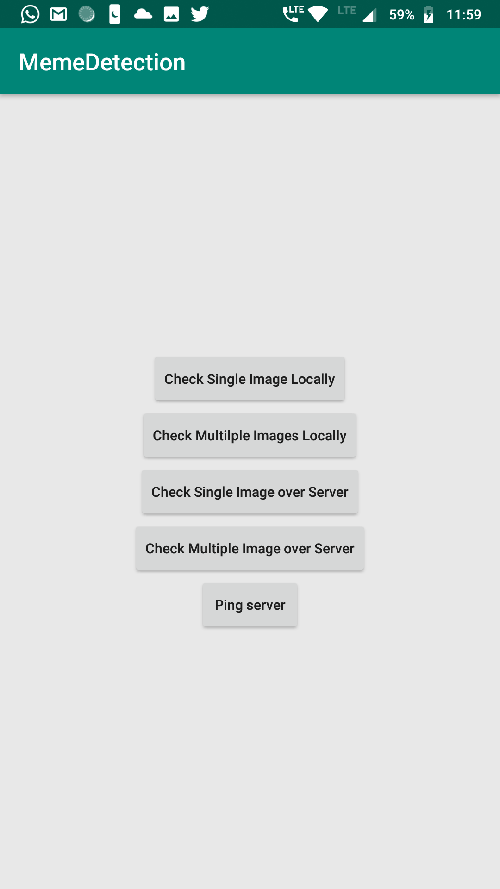 | 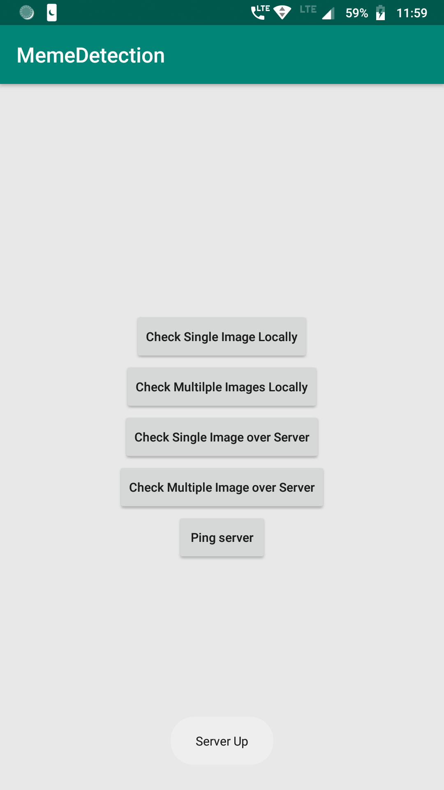|

1. Check single Images Locally
2. Check Multiple Images Locally
3. Check Single Image on Server(Flask REST API)
4. Check Multiple Image on Server(Flask REST API)
5. Ping

We have built 2 models. One is keras **VGG19** fine tune model and other is **MobileNet** Model. So we VGG19 model is deployed using **Flask framework** and Mobilenet Keras model convert to .tflite version using **TFLite** library.

Locally means we are testing on Mobilenet Model

Server means we are testing over VGG19 model.

### 1. Check single Images Locally

It means **Mobile-Net tflite** model is running locally and test only single image.

| | | | |
|:-------------------------:|:-------------------------:|:-------------------------:|:-------------------------:|
|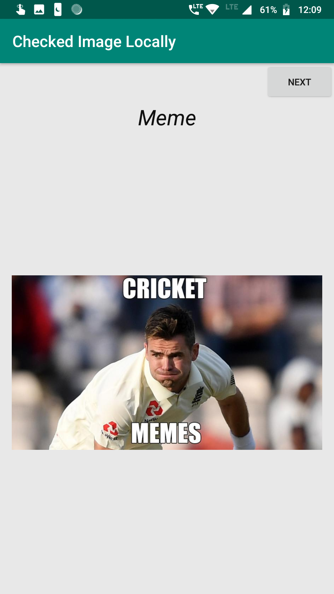    | 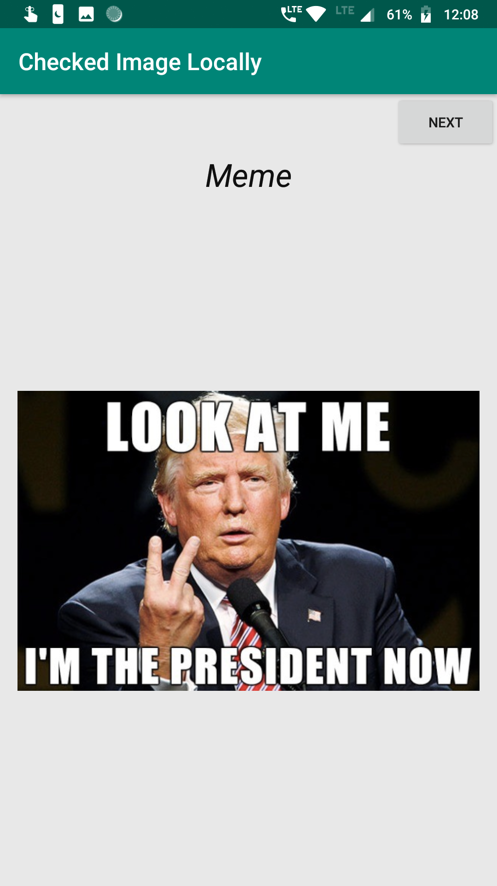 |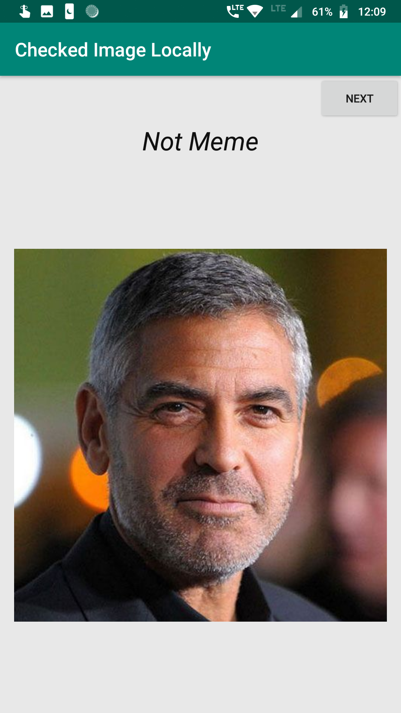 |   |

### 2. Check Multiple Images Locally
It means **Mobile-Net tflite** model is running locally and we are testing multiple images.

| | | |
|:-------------------------:|:-------------------------:|:-------------------------:|
|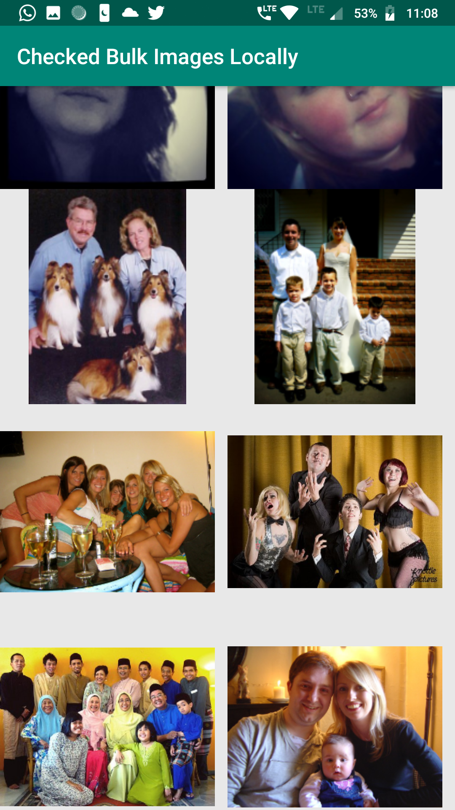 |  |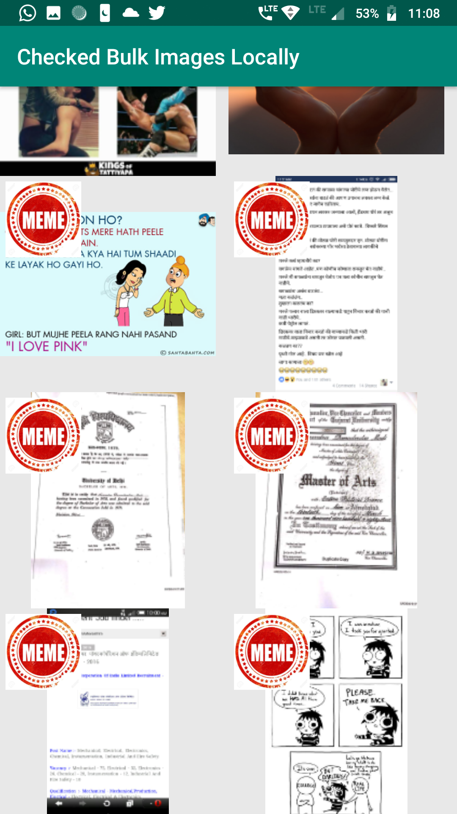 | 

### 3. Check Single Image on Server(Flask REST API)
It means fine tuned **VGG19** model is running flask GCP server and test only single image.

| | | |
|:-------------------------:|:-------------------------:|:-------------------------:|
|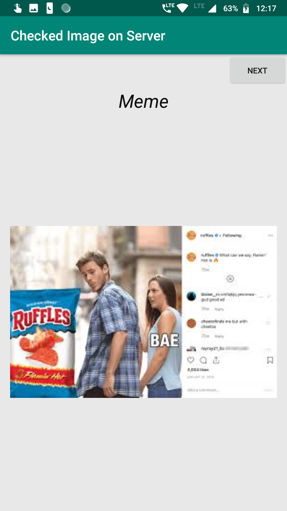 | 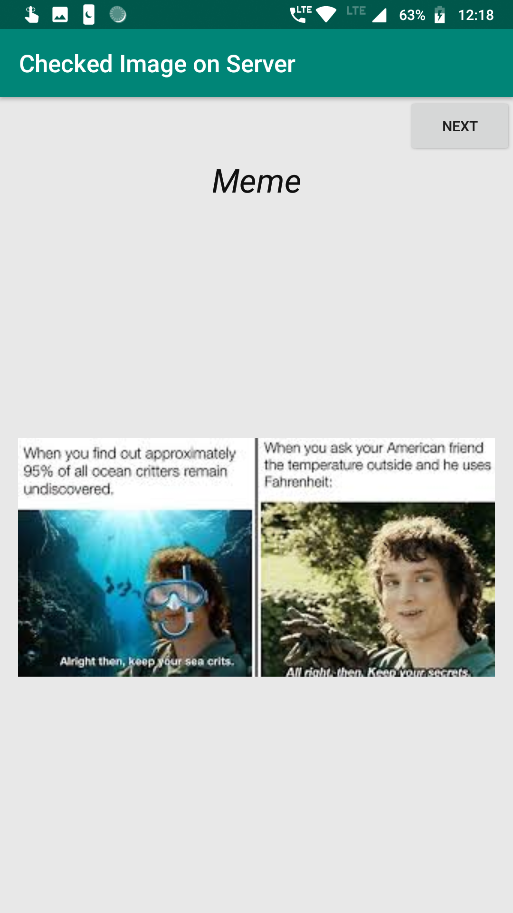 |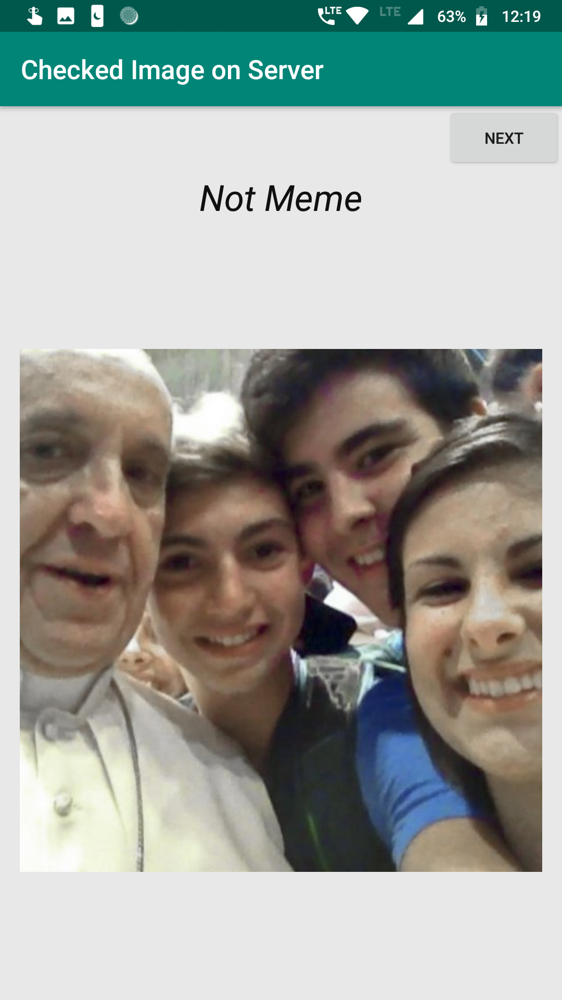 | 

## 4. Check Multiple Image on Server(Flask REST API)
It means fine tuned **VGG19** model is running flask GCP server and testing on multiple images.

| | | |
|:-------------------------:|:-------------------------:|:-------------------------:|
|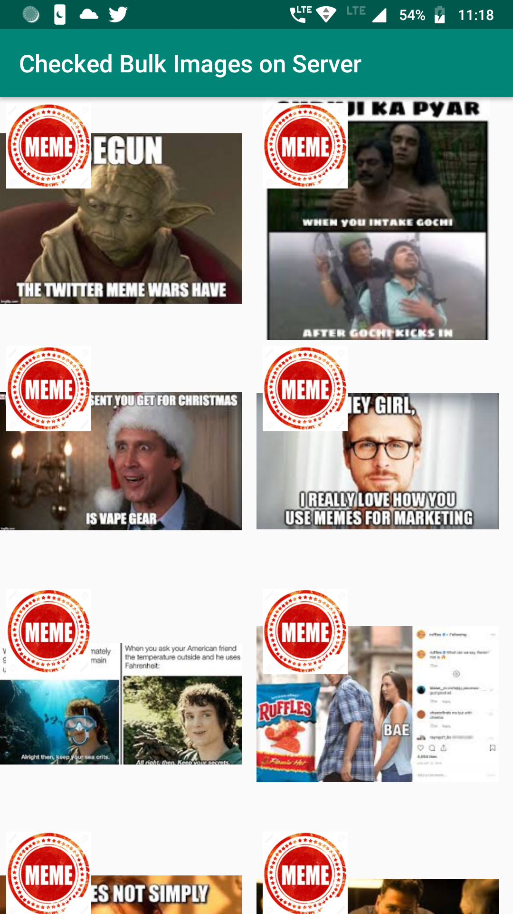 | 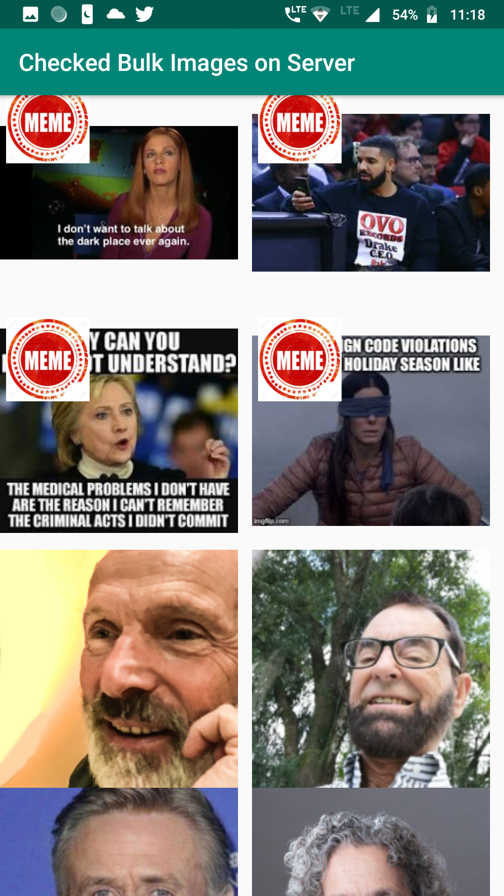 |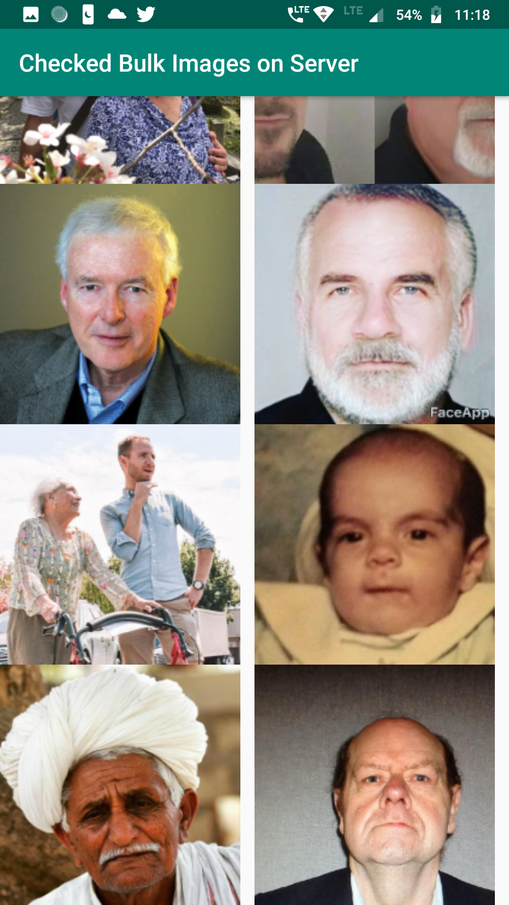 | 
